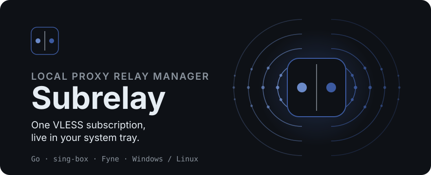
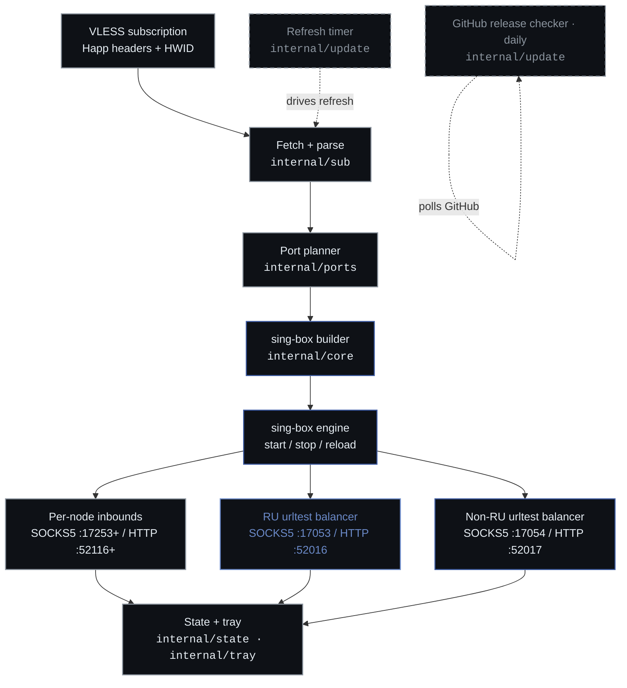

# Subrelay

[English](README.md) | [Русский](README.ru.md)

<p align="center">
  
</p>

<p align="center">
  <a href="https://go.dev"></a>
  <a href="https://github.com/shtorm-7/sing-box-extended"></a>
  <a href="https://fyne.io"></a>
  
  
  
</p>

Subrelay is a tray-resident desktop application that turns a single
VLESS subscription into a local sing-box-extended instance with stable per-node
SOCKS5/HTTP ports and RU/non-RU urltest balancers. It runs on Windows
and Linux, lives in the system tray, and refreshes the subscription
automatically.

## What it is

Subrelay is a Go application built on
[sing-box-extended](https://github.com/shtorm-7/sing-box-extended) (a
fork of [sing-box](https://github.com/SagerNet/sing-box) that adds the
xhttp transport and provider registry) and the [Fyne](https://fyne.io)
toolkit. It fetches a VLESS
subscription, parses the nodes, plans stable local ports for each
node, builds a sing-box configuration, and runs the engine. The whole
application lives in the system tray; configuration windows open on
demand and no manual config files are expected.

A single-instance lock prevents two concurrent instances from binding
the same local ports. On Windows the lock uses a named mutex; on Linux
it uses a file lock in the data directory.

## How it works



The refresh cycle runs on every tick of the update timer and on manual
refresh from the tray or the nodes window:

1. **Fetch + parse** (`internal/sub`) - downloads the subscription
   body over HTTP with Happ client headers (User-Agent, X-HWID,
   X-Device-OS, and others), then parses VLESS links from plain text
   or Base64-encoded bodies. Supports TCP, gRPC, WebSocket, and xhttp
   transports; TLS with uTLS; and Reality.
2. **Port planner** (`internal/ports`) - allocates stable SOCKS5 and
   HTTP ports for each node from configurable start offsets, detects
   conflicts, preserves existing assignments, and persists the
   tag-to-port mapping in settings so proxy URLs stay valid across
   restarts.
3. **sing-box builder** (`internal/core`) - converts the parsed nodes,
   port assignments, and user settings into sing-box `option.Options`
   with inbounds, VLESS outbounds, RU/non-RU urltest groups, route
   rules, and DNS.
4. **Engine reload** (`internal/core`) - recreates the sing-box
   instance with the new options. If a reload fails, the previous
   instance keeps running; the error is surfaced in the tray and logs
   without crashing the process.
5. **State + tray** (`internal/state`, `internal/tray`) - updates the
   runtime snapshot and rebuilds the tray menu with the balancer
   submenus (with copy-to-clipboard), nodes submenu, and status line.

A separate GitHub release checker (`internal/update`) runs on startup
and then once per day. On a newer release it sends a system
notification; a manual check from the settings window shows a dialog
with a link to the release page.

## How to use

### Install from releases

Download the latest artifact for your platform from the
[Releases page](https://github.com/overklassniy/subrelay/releases):

| Platform | Artifact |
| --- | --- |
| Windows amd64 / 386 / arm64 | `subrelay-<version>-windows-<arch>.zip` |
| Linux amd64 / arm64 / arm / 386 | `subrelay-<version>-linux-<arch>.deb`, `.rpm`, or `.tar.gz` |

On Linux, install the `.deb` or `.rpm` package with your package
manager. The package installs the binary, the `.desktop` menu entry,
and the icon, and refreshes the desktop database on install.

On Windows, extract the `.zip` and run `subrelay.exe`.

### First run

On first launch, if no subscription URL is configured, Subrelay shows a
first-run wizard. Paste your VLESS subscription URL and apply. Subrelay
fetches the subscription, plans ports, builds the configuration, and
starts the engine.

The application then lives in the system tray. Open the tray menu to:

- Copy any balancer SOCKS/HTTP address to the clipboard.
- Open the **Nodes** window to see each node's name, transport, RU
  override, and SOCKS/HTTP ports, with a search field and a Refresh
  button.
- Open **Settings** to edit the subscription URL, port ranges, urltest
  parameters, request headers, refresh interval, language, and
  autostart.
- Open **Logs** to inspect the ring buffer with a level filter, clear
  the in-memory buffer, open the log file, or dump the last built
  sing-box configuration to disk.
- **Refresh now** to trigger a full fetch-parse-plan-build-reload
  cycle immediately.

Point your client at the balancer endpoints. The default balancer
ports are:

| Balancer | SOCKS5 | HTTP |
| --- | --- | --- |
| RU | `127.0.0.1:17053` | `127.0.0.1:52016` |
| Non-RU | `127.0.0.1:17054` | `127.0.0.1:52017` |

Per-node SOCKS5 and HTTP ports start at `17253` and `52116`
respectively and are listed in the Nodes window.

## Build from source

### Prerequisites

- Go 1.26.4 or newer.
- A C compiler (CGO is required for the Fyne GLFW backend).
  - Native build: `gcc` on Linux, MinGW-w64 on Windows.
  - Cross-compilation: the target's cross-compiler (see the table in
    [`scripts/README.md`](scripts/README.md)).
- Build tags `with_utls,with_grpc,with_quic` (set by the Makefile).

### Build

```sh
# Native build for the host platform
make build

# Build all Windows architectures
make build-windows

# Build all Linux architectures
make build-linux

# Build every supported target
make build-all

# Build and package all Linux targets (.deb, .rpm, .tar.gz)
make package-linux VERSION=1.0.0
```

Override `VERSION` to inject a version string used by the GitHub
release checker:

```sh
make build VERSION=1.2.3
```

See the [`Makefile`](Makefile) for the full target list and
[`scripts/build.sh`](scripts/build.sh) for single-target
cross-compilation with optional packaging.

## Configuration

All settings are edited through the Settings window; no manual config
files are expected. Defaults (from `internal/config/settings.go`):

| Setting | Default |
| --- | --- |
| Subscription refresh interval | 30 min |
| Per-node SOCKS5 port start | 17253 |
| Per-node HTTP port start | 52116 |
| RU balancer SOCKS5 / HTTP | 17053 / 52016 |
| Non-RU balancer SOCKS5 / HTTP | 17054 / 52017 |
| urltest interval | 180 s |
| urltest tolerance | 50 ms |
| urltest probe URL | `http://connectivity-check.ubuntu.com/generate_204` |
| User-Agent | `subrelay/1.0` |
| X-Device-OS | `Linux` |

The urltest probe uses the Ubuntu connectivity-check endpoint over
HTTP instead of `gstatic.com` because Google infrastructure is
periodically blocked or throttled by Roskomnadzor, which would make
urltest unreliable for Russian proxy nodes. HTTP avoids TLS handshake
overhead in latency measurements and prevents SNI-based DPI blocking.

## Supported targets

| Target | Cross-compiler |
| --- | --- |
| `linux/amd64` | `gcc` |
| `linux/arm64` | `aarch64-linux-gnu-gcc` |
| `linux/arm` | `arm-linux-gnueabihf-gcc` |
| `linux/386` | `gcc -m32` |
| `windows/amd64` | `x86_64-w64-mingw32-gcc` |
| `windows/386` | `i686-w64-mingw32-gcc` |
| `windows/arm64` | `zig cc -target aarch64-windows-gnu` |

## Project structure

```
subrelay
├── cmd/subrelay/        Application entry point; wires all subsystems
├── internal/
│   ├── autostart/       OS-level autostart (Windows registry, Linux .desktop)
│   ├── config/          Settings persistence and defaults
│   ├── core/            sing-box option builder and engine lifecycle
│   ├── i18n/            Russian and English UI translations
│   ├── logging/         Ring buffer logger with file output
│   ├── paths/           Filesystem path resolution
│   ├── ports/           Stable port planning, persisted across restarts
│   ├── state/           Runtime snapshot for tray and UI
│   ├── sub/             Subscription fetch and VLESS link parser
│   ├── tray/            System tray icon and menu
│   ├── ui/              Settings, nodes, and logs windows
│   └── update/          Refresh timer and GitHub release checker
├── packaging/           Linux packaging templates and scripts
├── scripts/             Cross-compilation build helper
└── assets/readme/       README SVG assets
```

Each directory has its own `README.md` with purpose, contents, and
dependency notes. See [`internal/README.md`](internal/README.md) and
[`cmd/README.md`](cmd/README.md) for the package layering.

## Contributing

Contributions are welcome. Before submitting a change:

1. Run `make vet` and `make test` (both require `CGO_ENABLED=1`).
2. Run `make fmt` and fix any formatting issues with `make fmt-write`.
3. Follow the existing godoc-style comment conventions.
4. Update or add directory `README.md` files when a directory's
   contents or purpose changes.

## License

To be determined. No license file is present yet.
