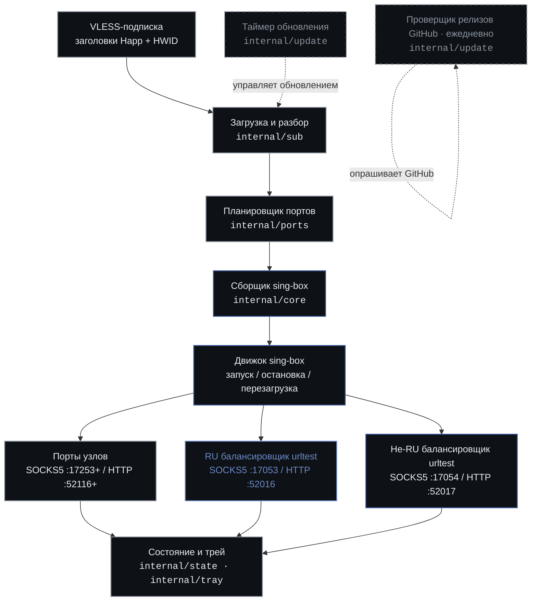

# Subrelay

<p align="center">
  
</p>

<p align="center">
  <a href="https://go.dev"></a>
  <a href="https://github.com/shtorm-7/sing-box-extended"></a>
  <a href="https://fyne.io"></a>
  
  
  
</p>

<p align="center">
  <a href="README.md">English</a> | <a href="README.ru.md">Русский</a>
</p>

Subrelay - это резидентное приложение в системном трее, которое
превращает одну VLESS-подписку в локальный экземпляр sing-box-extended со
стабильными SOCKS5/HTTP-портами для каждого узла и
балансировщиками urltest для RU и не-RU групп. Оно работает на
Windows и Linux, живёт в системном трее и автоматически обновляет
подписку.

## Что это

Subrelay - это приложение на Go, построенное на
[sing-box-extended](https://github.com/shtorm-7/sing-box-extended) (форк
[sing-box](https://github.com/SagerNet/sing-box), добавляющий транспорт
xhttp и реестр провайдеров) и тулките
[Fyne](https://fyne.io). Оно загружает VLESS-подписку, разбирает
узлы, планирует стабильные локальные порты для каждого узла, собирает
конфигурацию sing-box и запускает движок. Всё приложение живёт в
системном трее; окна настроек открываются по запросу, ручных
конфигурационных файлов не предусмотрено.

Блокировка одного экземпляра не даёт двум параллельным копиям
привязать одни и те же локальные порты. На Windows используется
именованный мьютекс, на Linux - файловая блокировка в каталоге
данных.

## Как это работает



Цикл обновления запускается на каждом тике таймера и при ручном
обновлении из трея или окна узлов:

1. **Загрузка и разбор** (`internal/sub`) - скачивает тело подписки
   по HTTP с заголовками клиента Happ (User-Agent, X-HWID,
   X-Device-OS и другими), затем разбирает VLESS-ссылки из
   простого текста или Base64-кодированного тела. Поддерживаются
   транспорты TCP, gRPC, WebSocket и xhttp; TLS с uTLS; и Reality.
2. **Планировщик портов** (`internal/ports`) - выделяет стабильные
   SOCKS5 и HTTP порты для каждого узла из настраиваемых начальных
   смещений, обнаруживает конфликты, сохраняет существующие
   назначения и хранит привязку тег-к-порту в настройках, чтобы
   URL прокси оставались действительными между перезапусками.
3. **Сборщик sing-box** (`internal/core`) - преобразует разобранные
   узлы, назначения портов и пользовательские настройки в
   `option.Options` для sing-box с inbounds, VLESS outbounds,
   группами urltest для RU и не-RU, правилами маршрутизации и DNS.
4. **Перезагрузка движка** (`internal/core`) - пересоздаёт экземпляр
   sing-box с новыми параметрами. Если перезагрузка не удалась,
   предыдущий экземпляр продолжает работать; ошибка выводится в
   трей и журнал, не завершая процесс.
5. **Состояние и трей** (`internal/state`, `internal/tray`) -
   обновляет снимок состояния и перестраивает меню трея с
   подменю балансировщиков (с копированием в буфер), подменю узлов
   и строкой статуса.

Отдельный проверщик релизов GitHub (`internal/update`) запускается
при старте, а затем раз в день. При появлении нового релиза он
отправляет системное уведомление; ручная проверка из окна настроек
показывает диалог со ссылкой на страницу релиза.

## Как использовать

### Установка из релизов

Скачайте актуальный артефакт для вашей платформы со
[страницы релизов](https://github.com/overklassniy/subrelay/releases):

| Платформа | Артефакт |
| --- | --- |
| Windows amd64 / 386 / arm64 | `subrelay-<version>-windows-<arch>.zip` |
| Linux amd64 / arm64 / arm / 386 | `subrelay-<version>-linux-<arch>.deb`, `.rpm` или `.tar.gz` |

На Linux установите пакет `.deb` или `.rpm` через ваш пакетный
менеджер. Пакет устанавливает бинарник, пункт меню `.desktop` и
иконку, а также обновляет базу рабочего стола при установке.

На Windows распакуйте `.zip` и запустите `subrelay.exe`.

### Первый запуск

При первом запуске, если URL подписки не задан, Subrelay показывает
мастер первичной настройки. Вставьте URL вашей VLESS-подписки и
примените. Subrelay загрузит подписку, спланирует порты, соберёт
конфигурацию и запустит движок.

Затем приложение живёт в системном трее. Откройте меню трея, чтобы:

- Скопировать любой SOCKS/HTTP-адрес балансировщика в буфер обмена.
- Открыть окно **Узлы**, чтобы увидеть имя каждого узла, транспорт,
  переопределение RU и SOCKS/HTTP-порты, с полем поиска и кнопкой
  обновления.
- Открыть **Настройки**, чтобы изменить URL подписки, диапазоны
  портов, параметры urltest, заголовки запросов, интервал
  обновления, язык и автозапуск.
- Открыть **Журнал**, чтобы просмотреть кольцевой буфер с фильтром по
  уровню, очистить буфер в памяти, открыть файл журнала или выгрузить
  последнюю собранную конфигурацию sing-box на диск.
- Выполнить **Обновить сейчас**, чтобы немедленно запустить полный
  цикл загрузка-разбор-планирование-сборка-перезагрузка.

Укажите вашему клиенту адреса балансировщиков. Порты балансировщиков
по умолчанию:

| Балансировщик | SOCKS5 | HTTP |
| --- | --- | --- |
| RU | `127.0.0.1:17053` | `127.0.0.1:52016` |
| Не-RU | `127.0.0.1:17054` | `127.0.0.1:52017` |

SOCKS5 и HTTP-порты для отдельных узлов начинаются с `17253` и
`52116` соответственно и перечислены в окне узлов.

## Сборка из исходников

### Требования

- Go 1.26.4 или новее.
- Компилятор C (CGO требуется для GLFW-бэкенда Fyne).
  - Нативная сборка: `gcc` на Linux, MinGW-w64 на Windows.
  - Кросс-компиляция: кросс-компилятор целевой платформы (см. таблицу
    в [`scripts/README.md`](scripts/README.md)).
- Теги сборки `with_utls,with_grpc,with_quic` (задаются Makefile).

### Сборка

```sh
# Нативная сборка для текущей платформы
make build

# Сборка всех архитектур Windows
make build-windows

# Сборка всех архитектур Linux
make build-linux

# Сборка всех поддерживаемых целей
make build-all

# Сборка и упаковка всех целей Linux (.deb, .rpm, .tar.gz)
make package-linux VERSION=1.0.0
```

Переопределите `VERSION`, чтобы подставить строку версии для
проверщика релизов GitHub:

```sh
make build VERSION=1.2.3
```

Полный список целей - в [`Makefile`](Makefile); одинарную
кросс-компиляцию с необязательной упаковкой выполняет
[`scripts/build.sh`](scripts/build.sh).

## Настройка

Все настройки редактируются через окно настроек; ручных
конфигурационных файлов не предусмотрено. Значения по умолчанию (из
`internal/config/settings.go`):

| Параметр | По умолчанию |
| --- | --- |
| Интервал обновления подписки | 30 мин |
| Начальный SOCKS5-порт узла | 17253 |
| Начальный HTTP-порт узла | 52116 |
| RU балансировщик SOCKS5 / HTTP | 17053 / 52016 |
| Не-RU балансировщик SOCKS5 / HTTP | 17054 / 52017 |
| Интервал urltest | 180 с |
| Допуск urltest | 50 мс |
| URL проверки urltest | `http://connectivity-check.ubuntu.com/generate_204` |
| User-Agent | `subrelay/1.0` |
| X-Device-OS | `Linux` |

Проверка urltest использует эндпоинт Ubuntu connectivity-check по
HTTP вместо `gstatic.com`, потому что инфраструктура Google
периодически блокируется или ограничивается Роскомнадзором, что
делает urltest ненадёжным для российских прокси-узлов. HTTP избегает
накладных расходов на TLS-рукопожатие при измерении задержки и
предотвращает DPI-блокировку по SNI.

## Поддерживаемые цели

| Цель | Кросс-компилятор |
| --- | --- |
| `linux/amd64` | `gcc` |
| `linux/arm64` | `aarch64-linux-gnu-gcc` |
| `linux/arm` | `arm-linux-gnueabihf-gcc` |
| `linux/386` | `gcc -m32` |
| `windows/amd64` | `x86_64-w64-mingw32-gcc` |
| `windows/386` | `i686-w64-mingw32-gcc` |
| `windows/arm64` | `zig cc -target aarch64-windows-gnu` |

## Структура проекта

```
subrelay
├── cmd/subrelay/        Точка входа приложения; связывает все подсистемы
├── internal/
│   ├── autostart/       Автозапуск на уровне ОС (реестр Windows, .desktop Linux)
│   ├── config/          Хранение настроек и значения по умолчанию
│   ├── core/            Сборщик параметров sing-box и жизненный цикл движка
│   ├── i18n/            Переводы интерфейса на русский и английский
│   ├── logging/         Логгер с кольцевым буфером и выводом в файл
│   ├── paths/           Разрешение путей в файловой системе
│   ├── ports/           Планирование стабильных портов с сохранением между запусками
│   ├── state/           Снимок состояния для трея и интерфейса
│   ├── sub/             Загрузка подписки и разбор VLESS-ссылок
│   ├── tray/            Иконка и меню в системном трее
│   ├── ui/              Окна настроек, узлов и журнала
│   └── update/          Таймер обновления и проверщик релизов GitHub
├── packaging/           Шаблоны и скрипты упаковки для Linux
├── scripts/             Помощник кросс-компиляции
└── assets/readme/       SVG-ассеты для README
```

В каждом каталоге есть собственный `README.md` с описанием цели,
содержимого и зависимостей. Слои пакетов описаны в
[`internal/README.md`](internal/README.md) и
[`cmd/README.md`](cmd/README.md).

## Участие в разработке

Приветствуются вклады. Перед отправкой изменения:

1. Выполните `make vet` и `make test` (оба требуют `CGO_ENABLED=1`).
2. Выполните `make fmt` и исправьте замечания по форматированию через
   `make fmt-write`.
3. Следуйте существующим соглашениям godoc-комментариев.
4. Обновляйте или добавляйте `README.md` в каталоге, если его
   содержимое или назначение меняются.

## Лицензия

Subrelay распространяется под
[Универсальной общественной лицензией GNU v3.0](LICENSE). Проект
ссылается на
[sing-box-extended](https://github.com/shtorm-7/sing-box-extended),
который также использует GPLv3, поэтому та же лицензия применяется
ко всей программе.

Copyright (C) 2026 overklassniy. Эта программа распространяется без
КАКИХ-ЛИБО ГАРАНТИЙ; подробности - в [лицензии](LICENSE).
